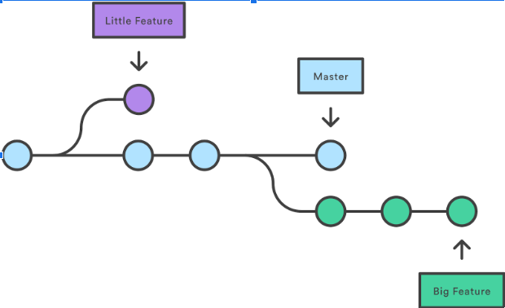
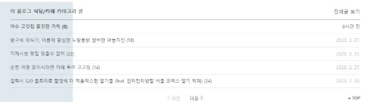
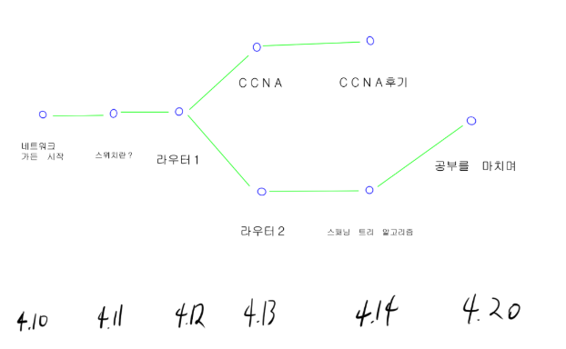

2020-04-05
별찬: [참고] 프로토타이핑 디자인 툴로 Adobe XD가 있는데 공동 작업을 해야할 경우 유용할 수도 있다. 무료로 사용 가능

별찬: [제안] 콘텐츠의 생산자가 곧 소비자가 되는 컨셉은 어떨까? 내가 작성한 컨텐츠를 기반으로 추천 컨텐츠가 표시되고 이를 소비하면서 다시 무한 동력이 발생하는거지. 개발자의 대부분은 문서를 읽으면서 콘텐츠를 ‘소비’만 하는 경우가 많은데 음지에 있는 그들을 양지로 끌어내서 글을 쓰면서 얻는 재미를 느끼게하고 다른 사람을 가르치면서 배운 내용을 복습하는 경험을 갖게 해주면 좋을 것 같아.

2020-04-06
별찬: [제안] 내일 서비스의 기능이 정확히 결정된 뒤에 ‘디자인 컨셉’을 결정하면 좋을 것 같다. 폰트, 폰트 사이즈, 컬러 스키마 정도는 3~4가지의 수준으로 정하고 시작해보자.
 [참고]: https://joshua1988.github.io/web-development/design/ui-for-developers/

2020-04-09
이산:[제안]블로그의 정체성을 ‘공부’로 잡아보면 어떨까? 가드너 프로젝트는 매일매일 잔디를 심는것을 장려하는것이 그 시초였다. 소스코드에서 글(정확히는 글과 그림, 사진 등을 포함하는 파일)을 게시하는 블로그의 형태로 바꼈지만, 기본적으로 매일매일 작성하는것을 목표로 하는 정체성을 유지했으면 한다. 다른 사람의 가든을 팔로우해서 그 사람의 공부 방식을 흡수하는것도 좋고, 스스로 공부한것을 복습겸 올리면서 그 주기와 주로 업로드하는 시간, 한 번에 올리는 분량 등을 파악하는것도 좋아보인다. 플래너의 기능을 하는 “재배 계획서” 등의 기능도 있다면 좋을거 같다.

2020-04-14
이산:[제안]깃 GUI를 써본 사람이라면 아래와 같이 브런치가 도식화된것을 본 적이 있을 것이다.

이걸 우리 가든에 적용시켜보는게 어떨까
일반적으로 블로그 글을 보면 아래와 같은 부분이 글의 위에 위치해있다

우리 글에서는 저 게시물 목록이 아니라

(조악해서 미안하지만) 위와 같은 git의 브런치 구조를 표현하는것이다. 이렇게 함으로써 우리의 가든(프로젝트)가 언제 시작되었고 어느방식으로 진행되었으며, 어떻게 다른 가든으로 분기되는가를 보여주는것이다.(예를 들자면, 네트워크 공부 용도로 가든을 만들고 매일 글을 올리고 있었다고 하자. 공부가 깊어지면서 미들웨어에 대한 커밋(글 업로드)가 몇 번 있었고 아예 일정 시점에서 미들웨어 가든을 새로 생성하게 되는 것이다!)
위와 같은 형태의 이미지는 다른 블로그 사이트와 다른 우리만의 강점이 될 수 있을거라 생각한다.
